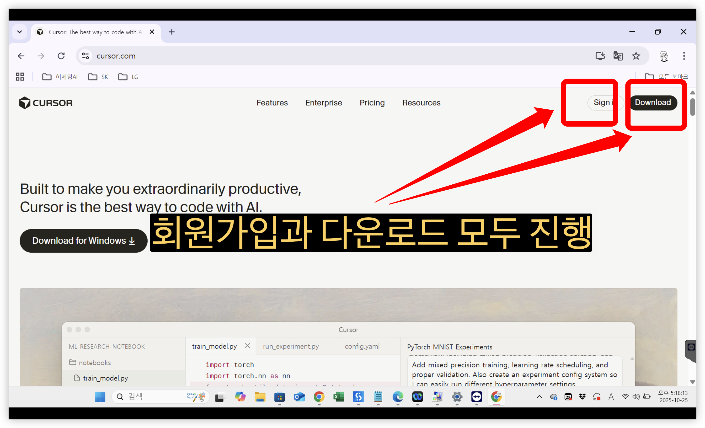
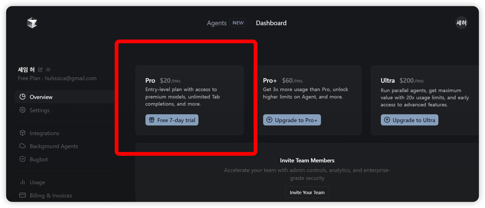
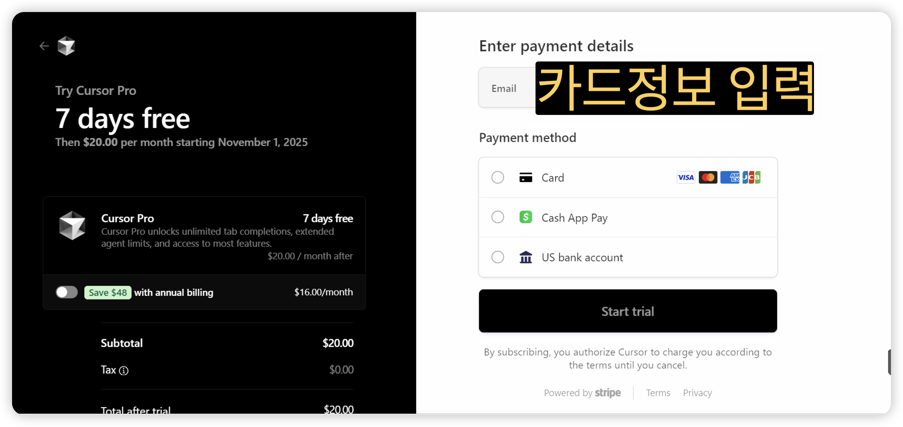
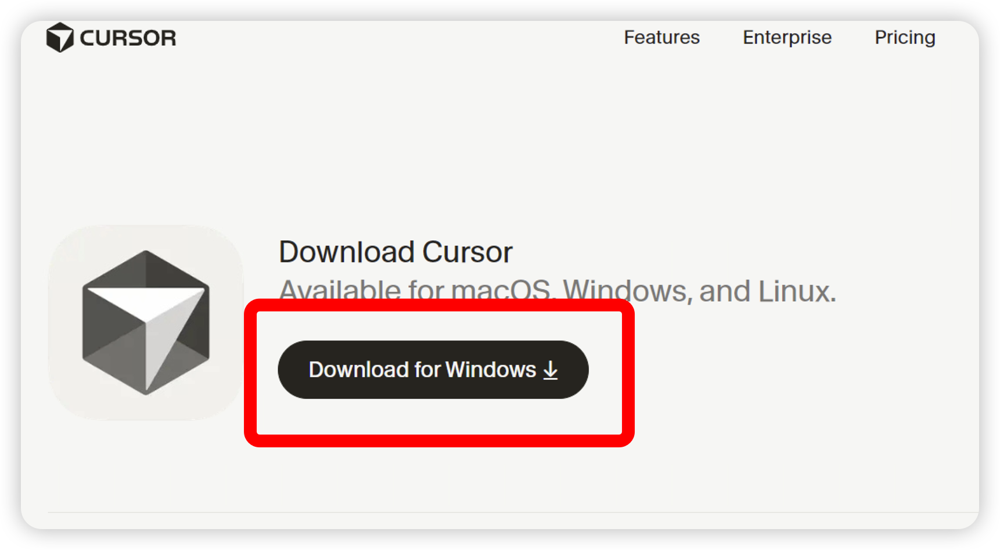
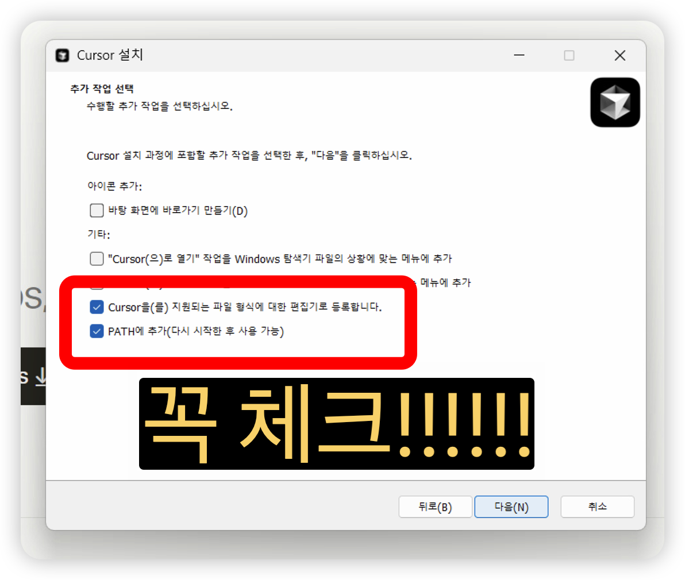
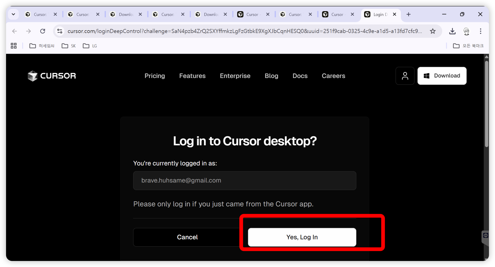
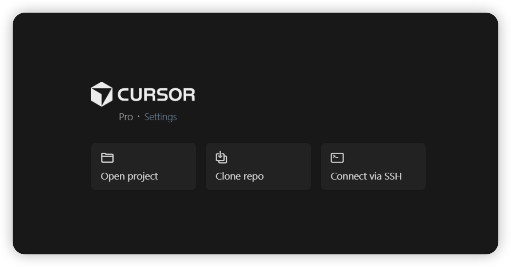
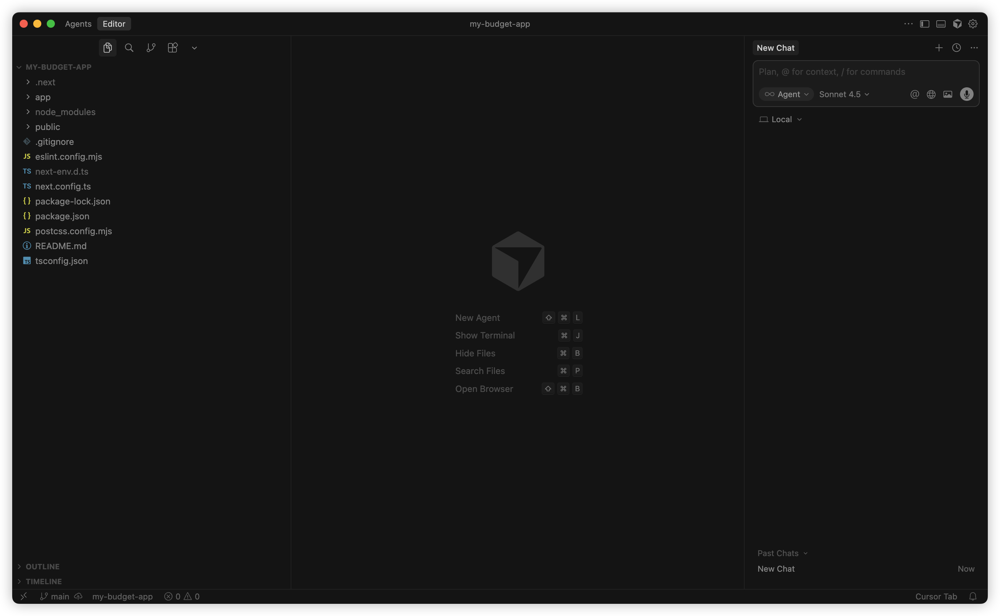
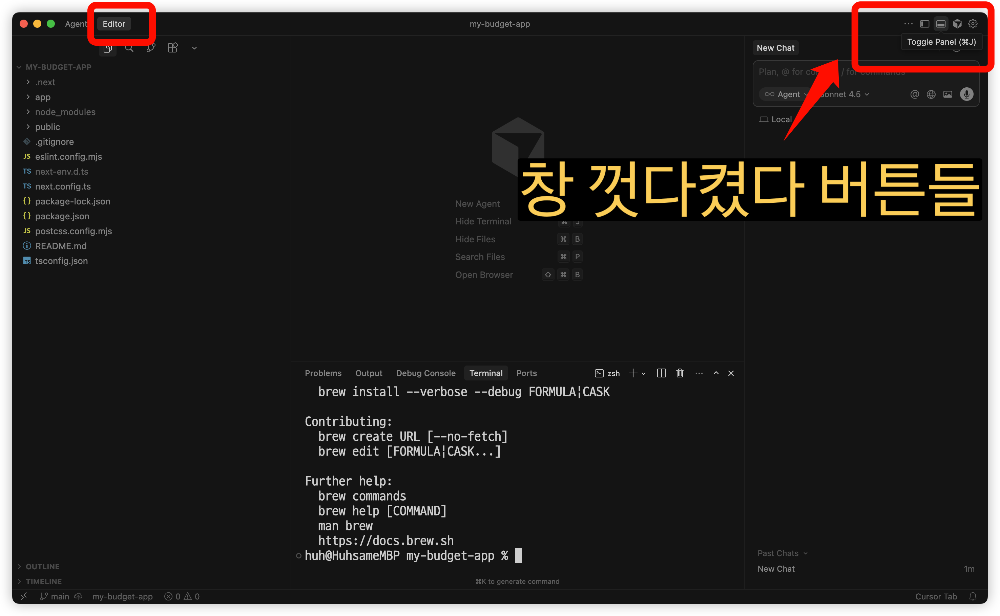

# Chapter 1. 강의 소개

## 이 강의에서 배울 것

이 강의를 마치면 여러분은:

- ✅ AI에게 명령해서 코드를 만들 수 있습니다
- ✅ 나만의 웹 서비스를 만들 수 있습니다
- ✅ 데이터베이스에 정보를 저장할 수 있습니다
- ✅ 만든 서비스를 인터넷에 공개할 수 있습니다

**코딩을 몰라도 됩니다.** AI가 코드를 대신 작성해주니까요!

---

## 만들게 될 프로젝트

### 프로젝트 1: 가계부 앱 💰

수입과 지출을 기록하고 관리하는 앱입니다.

**주요 기능:**
- 수입/지출 기록하기
- 카테고리별 분류 (식비, 교통, 월급 등)
- 총 수입/지출/잔액 확인
- 기록 삭제하기

<!-- 스크린샷: 완성된 가계부 앱 -->

---

### 프로젝트 2: 고구마마켓 🍠

중고거래 플랫폼입니다. (당근마켓 같은!)

**주요 기능:**
- 회원가입 / 로그인
- 상품 등록하기
- 상품 목록 보기
- 상품 상세 보기
- 댓글 달기
- 이미지 업로드
- 검색 기능

<!-- 스크린샷: 완성된 고구마마켓 -->

---

## 1.1 커서(Cursor)란?

### 쉽게 말하면

> **AI 비서가 내장된 코드 편집기**입니다.
>
> "로그인 기능 만들어줘"라고 말하면,
> 진짜로 코드를 작성해줍니다.
>
> 마치 옆에 개발자가 앉아서
> 대신 코딩해주는 느낌이에요!

### 왜 커서를 쓰나요?

| 기능 | 일반 편집기 | 커서 (Cursor) |
|------|------------|--------------|
| 코드 작성 | 직접 타이핑 | AI가 대신 작성 |
| 에러 수정 | 구글 검색 | AI에게 질문 |
| 코드 이해 | 문서 찾아보기 | AI가 설명해줌 |
| 새 기능 추가 | 처음부터 작성 | "~해줘" 한마디 |

---

## 1.2 커서 설치하기

### Step 1: 회원가입 / 로그인

1. Cursor 접속
2. **Sign Up** 또는 **Log In** 클릭
3. 이메일 또는 Google/GitHub 계정으로 가입




### Step 2: 다운로드

   
1. **Download** 버튼 클릭
2. 운영체제에 맞는 버전이 자동으로 다운로드됩니다


### Step 2: 설치하기

**Windows:**
1. 다운로드된 `CursorSetup.exe` 파일 실행
2. 설치 진행 (Next 계속 클릭)
3. 완료!

**Mac:**
1. 다운로드된 `Cursor.dmg` 파일 열기
2. Cursor 아이콘을 Applications 폴더로 드래그
3. 처음 실행 시 "열기" 허용


### Step 4: 설치된 커서에 로그인

처음 실행하면 아까 가입한 커서 계정으로 로그인을 하는 화면이 나옵니다.





---

## 1.3 커서 화면 익히기

커서를 실행하면 아래와 같은 화면이 나옵니다.


### 주요 영역

| 영역 | 위치 | 역할 |
|------|------|------|
| **사이드바** | 왼쪽 | 파일/폴더 탐색 |
| **에디터** | 가운데 | 코드 작성/편집 |
| **터미널** | 아래쪽 | 명령어 입력 |
| **AI 패널** | 오른쪽 | AI와 대화 |

### AI 기능 버튼들

커서에는 AI와 소통하는 여러 방법이 있습니다.

<!-- 스크린샷: AI 버튼들 위치 표시 -->

| 버튼/기능 | 용도 |
|----------|------|
| **Chat** | AI와 대화하기 (질문, 설명 요청) |
| **agent** | 코드 생성하기 |
| **Plan 모드** | AI가 전체 계획을 세우고 실행 |

> 이 버튼들은 나중에 자세히 배울 거예요.
> 지금은 위치만 확인해두세요!

### 터미널 열기

터미널은 컴퓨터에게 명령어를 입력하는 창입니다.



**터미널 여는 법:**
- 상단 메뉴: `View` → `Terminal`
- 또는 단축키: `` Ctrl + ` `` (Windows) / `` Cmd + ` `` (Mac)
- 우측 상단의 버튼으로!

---

## 1.4 Node.js 설치하기

### Node.js가 뭔가요?

> JavaScript를 컴퓨터에서 실행할 수 있게 해주는 도구입니다.
>
> 우리가 만들 웹 앱이 동작하려면 Node.js가 필요합니다.

### Step 1: 다운로드

1. 브라우저에서 **[nodejs.org](https://nodejs.org)** 접속
2. **LTS 버전** 다운로드 (왼쪽 초록 버튼)


> 💡 **LTS**란? Long Term Support의 약자로, 안정적인 버전이라는 뜻입니다.

### Step 2: 설치하기

**Windows:**
1. 다운로드된 `.msi` 파일 실행
2. Next 계속 클릭
3. 완료!

**Mac:**
1. 다운로드된 `.pkg` 파일 실행
2. 안내에 따라 설치
3. 완료!

### Step 3: 설치 확인

설치가 잘 됐는지 확인해봅시다.

**터미널을 열고, 아래 명령어를 직접 입력하세요:**

```bash
node --version
```

**Enter를 누르면 버전이 나와야 합니다:**

```
v20.10.0
```

(숫자는 다를 수 있어요. 버전이 나오면 성공!)

**npm도 확인해보세요:**

```bash
npm --version
```

```
10.2.3
```


---

## 1.5 설치 체크리스트

여기까지 완료했는지 확인해보세요!

- [ ] Cursor 설치 완료
- [ ] Cursor 로그인 완료
- [ ] Node.js 설치 완료
- [ ] `node --version` 확인 완료
- [ ] `npm --version` 확인 완료

모두 체크되었으면, 다음 챕터로 넘어가세요! 🎉

---

## 자주 발생하는 문제

### "node를 찾을 수 없습니다" 에러

```
'node'은(는) 내부 또는 외부 명령... 이 아닙니다.
```

**해결 방법:**
1. 터미널을 껐다가 다시 열어보세요
2. 그래도 안 되면 컴퓨터를 재시작하세요
3. 여전히 안 되면 Node.js를 다시 설치해보세요

### 커서가 영어로 나와요

한글로 바꾸고 싶다면:
1. `Ctrl + Shift + P` (Windows) / `Cmd + Shift + P` (Mac)
2. "Configure Display Language" 입력
3. "한국어" 선택

---

## 다음 챕터에서는

> AI에게 어떻게 요청해야 좋은 코드를 받을 수 있는지 배웁니다.
> AI가 준 코드를 어떻게 적용하는지도 알아봅니다.
>
> 👉 [Chapter 2. AI로 코딩하는 법](part1/chapter2-ai-coding.md)

