# Chapter 3. 가계부 앱 만들기

드디어 첫 번째 프로젝트를 만들어봅니다! 🎉

이번 챕터에서는 Cursor의 **Plan 모드**를 사용해서
가계부 앱을 한 번에 만들어볼 거예요.
가계부 앱을 만들면서, Next.js로 어떻게 웹이 구현되는지, 데이터베이스는 어떻게 연동하는지, 그리고 배포까지 진행해봅니다.

---

## 3.1 Next.js 프로젝트 만들기

### Next.js가 뭔가요?

> **웹사이트를 만드는 도구**입니다.
>
> 복잡한 설정 없이 바로 웹 개발을 시작할 수 있어요.
> 전 세계 많은 회사들이 사용하는 인기 있는 도구입니다.

지금은 자세히 몰라도 됩니다.
그냥 "웹사이트 만드는 도구구나~" 정도만 알면 돼요!

---

### Step 1: 프로젝트 생성하기

**커서말고** 컴퓨터에서 터미널을 열고, 아래 명령어를 입력하세요:

```bash
npx create-next-app@latest my-budget-app
```

Enter를 누르면 설치가 시작됩니다.

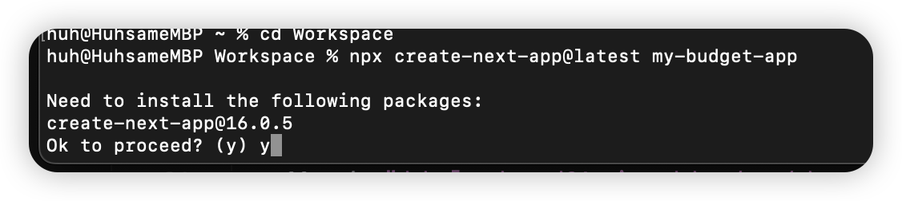

선택지가 나오면 그대로 엔터치거나 y를 누르고 엔터치세요.

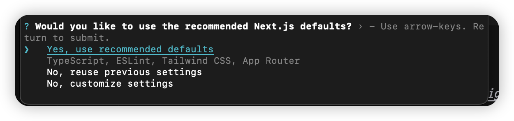
---

### Step 2: 옵션 선택하기

몇 가지 질문이 나옵니다. **화살표 키로 선택**하고 Enter를 누르세요.

```
✔ Would you like to use TypeScript? … Yes
✔ Would you like to use ESLint? … Yes
✔ Would you like to use Tailwind CSS? … Yes
✔ Would you like to use `src/` directory? … No
✔ Would you like to use App Router? (recommended) … Yes
✔ Would you like to customize the default import alias? … No
```

<!-- 스크린샷: 옵션 선택 화면 -->

> 💡 **잘 모르겠으면?**
> 위 설정 그대로 따라하시면 됩니다!

설치가 완료될 때까지 잠시 기다립니다. (1~2분 소요)

---

### Step 3: 프로젝트 폴더 열기

설치가 완료되면, 프로젝트 폴더를 **커서에서** 열어야 합니다.

**방법:**
1. 커서 상단 메뉴: `File` → `Open Folder`
2. 방금 만든 `my-budget-app` 폴더 선택
3. `Select Folder` 클릭

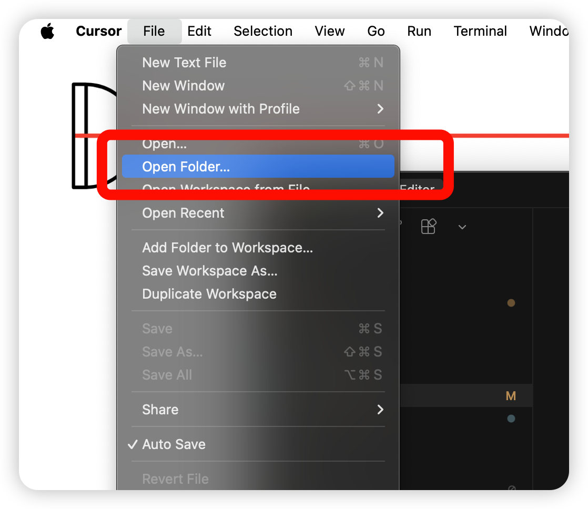

이제 왼쪽 사이드바에 프로젝트 파일들이 보입니다!

---

### Step 4: 개발 서버 실행하기

프로젝트가 제대로 만들어졌는지 확인해봅시다.

터미널에서 **아래 명령어를 실행**하세요:


```bash
npm run dev
```
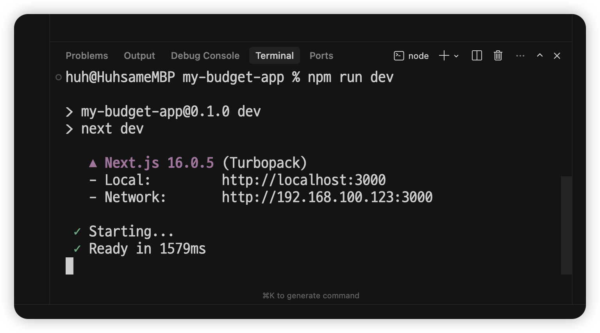

**결과:**
```
▲ Next.js 14.x.x
- Local:        http://localhost:3000

✓ Ready in 2.1s
```

이렇게 나오면 성공입니다!

---

### Step 5: 브라우저에서 확인하기

1. 브라우저(크롬)를 엽니다
2. 주소창에 `localhost:3000` 입력
3. Enter

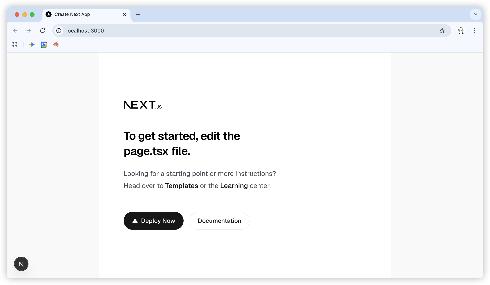

Next.js 기본 페이지가 보이면 성공! 🎉

> 💡 **localhost란?**
> "내 컴퓨터"를 의미하는 특별한 주소입니다.
> 아직 인터넷에 공개된 건 아니고, 내 컴퓨터에서만 볼 수 있어요.
> 
### Step 5: 직접 코드 수정해보기
page.tsx 파일을 찾아서 그림과 같이 텍스트를 수정하고, 브라우저에서 확인해봅니다. 

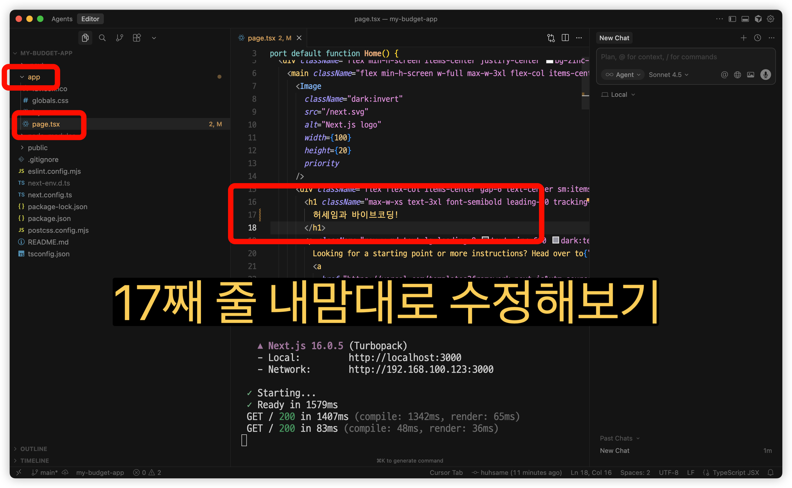
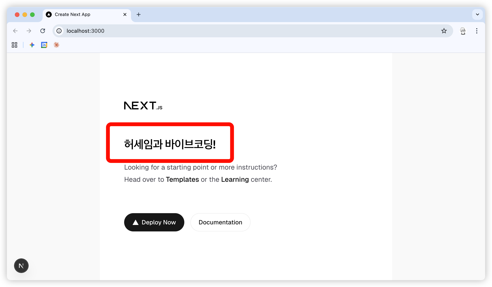

---

### 개발 서버 종료하기

개발 서버를 끄려면 터미널에서:
- Windows: `Ctrl + C`
- Mac: `Ctrl + C` (Cmd 아님!)

---

## 3.2 Plan 모드로 가계부 만들기

### Plan 모드란?

> **AI가 전체 계획을 세우고, 자동으로 실행해주는 기능**입니다.
>
> 우리는 뭘 만들고 싶은지만 설명하면,
> AI가 계획을 세우고 → 코드를 작성하고 → 파일을 만들어줍니다.
>
> "빌드" 버튼만 누르면 됩니다! 😎

---

### Step 1: Plan 모드 열기

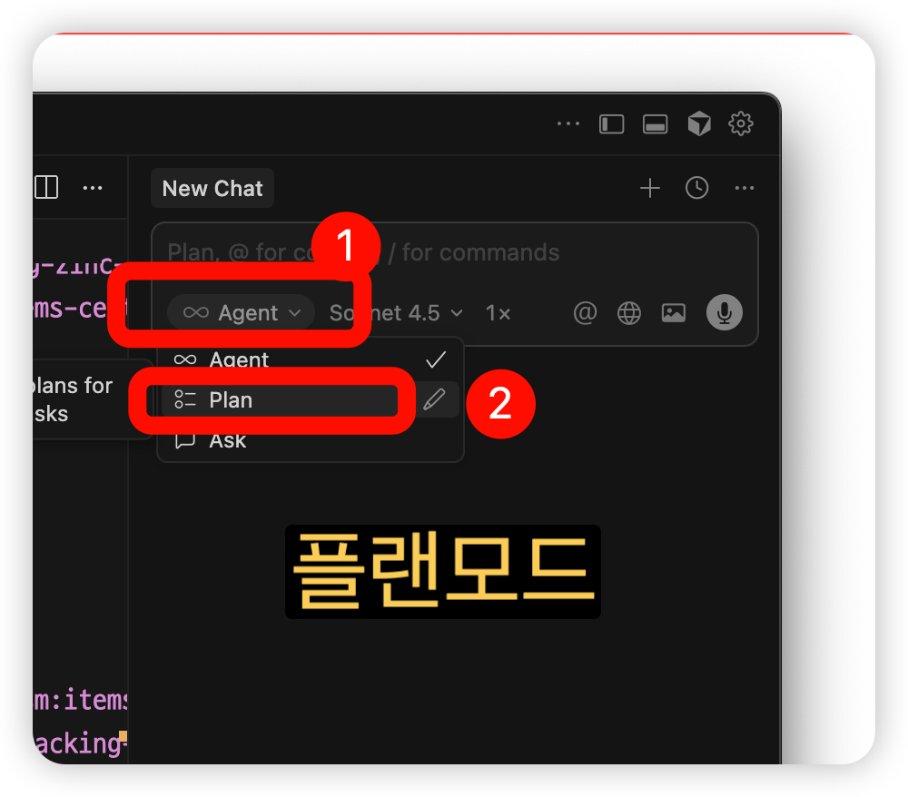

채팅에서 **Plan 모드** 버튼을 찾아 클릭합니다.

> 💡 버전에 따라 위치가 다를 수 있습니다.

---

### Step 2: 가계부 앱 요청하기

Plan 모드 입력창에 **아래 내용을 복사해서 붙여넣기**하세요:

```
가계부 앱을 만들어줘.

기능:
- 수입/지출 기록하기
  - 금액 (필수)
  - 내용 (예: 점심값, 월급)
  - 카테고리 (식비, 교통, 쇼핑, 월급, 기타)
  - 수입/지출 구분
- 기록 목록 보기 (최신순)
- 기록 삭제하기
- 상단에 요약 표시
  - 총 수입
  - 총 지출
  - 잔액 (수입 - 지출)

디자인:
- 깔끔한 카드 UI
- 화면 중앙 배치
- 수입은 파란색, 지출은 빨간색
- 금액은 원(₩) 단위, 콤마 표시

기술:
- TypeScript
- Tailwind CSS
- 'use client' 사용

아직 DB 연결 안 함.
새로고침하면 데이터가 초기화돼도 됨.
```

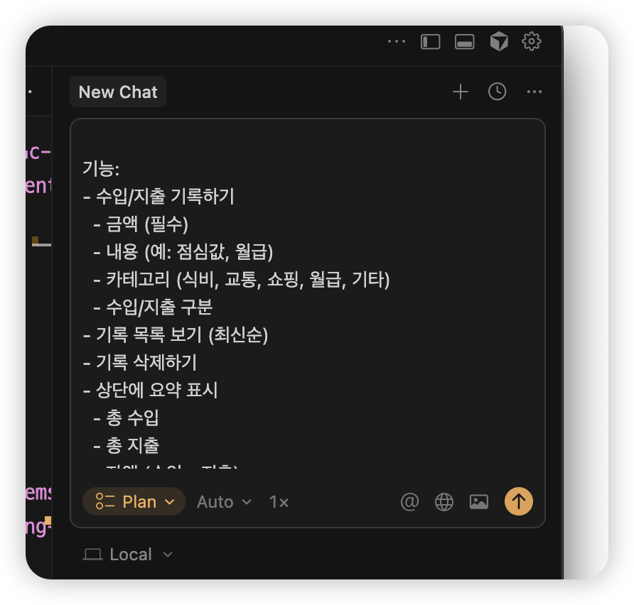
---

### Step 3: Plan 확인하기

요청을 보내면, AI가 계획을 세워서 보여줍니다.

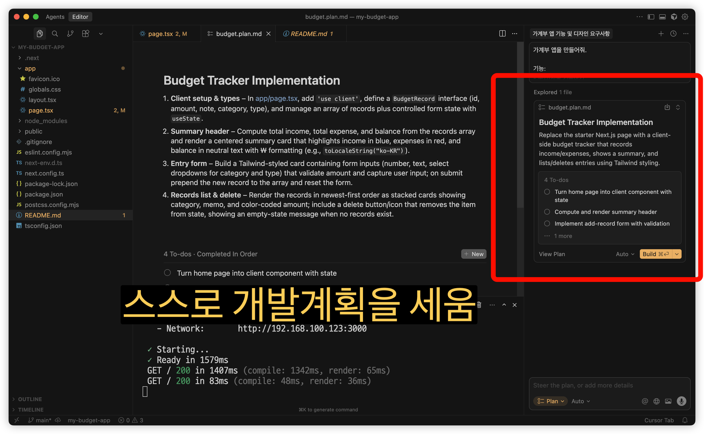
**예시 Plan:**
```
1. app/page.tsx 수정 - 메인 페이지에 가계부 UI 만들기
2. 컴포넌트 구조 설계
3. 수입/지출 입력 폼 만들기
4. 거래 내역 목록 만들기
5. 요약 카드 만들기
6. 스타일링 적용
```

계획이 마음에 들면 다음 단계로!

---

### Step 4: 빌드 버튼 누르기

**"Build"** 버튼을 클릭합니다.

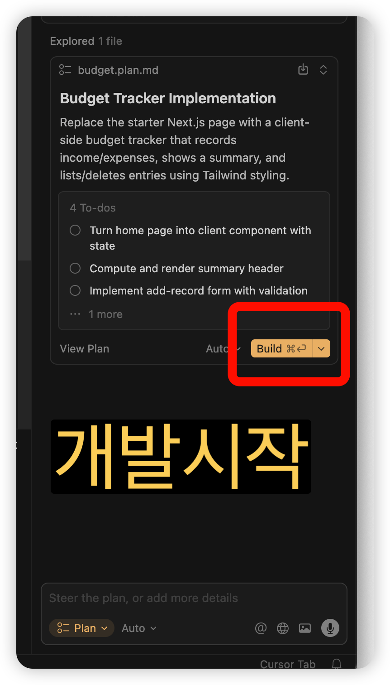

AI가 자동으로:
- 파일을 생성하고
- 코드를 작성합니다

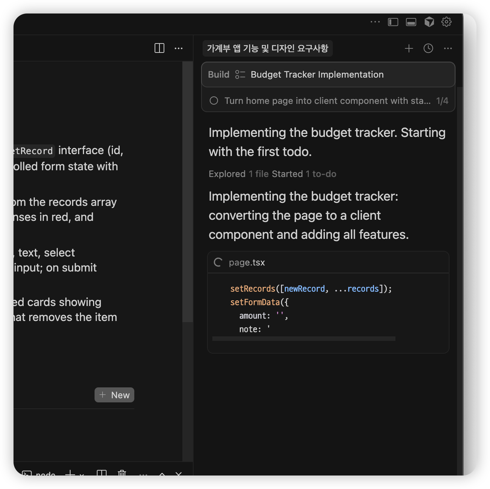

완료될 때까지 기다립니다. (30초 ~ 1분)

---

### Step 5: 결과 확인하기

빌드가 완료되면 커서의 대답을 모두 읽어보고 Keep !

1. **브라우저 확인**
   - `localhost:3000`으로 가서 새로고침
   - 또는 터미널에서 `npm run dev` 실행

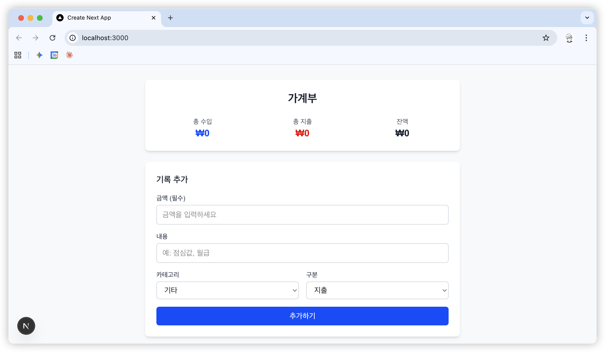
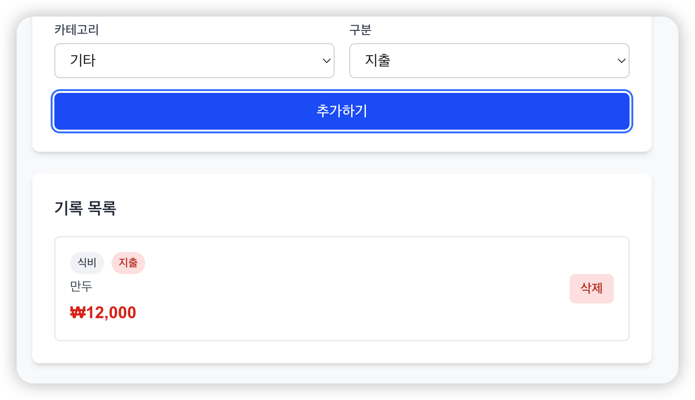

🎉 **가계부 앱이 완성되었습니다!**

---

## 3.3 가계부 테스트하기

만든 가계부가 잘 동작하는지 확인해봅시다.

### 테스트 1: 지출 기록하기

1. 금액에 `15000` 입력
2. 내용에 `점심` 입력
3. 카테고리에서 `식비` 선택
4. `지출` 선택
5. 추가 버튼 클릭


### 테스트 2: 수입 기록하기

1. 금액에 `3000000` 입력
2. 내용에 `월급` 입력
3. 카테고리에서 `월급` 선택
4. `수입` 선택
5. 추가 버튼 클릭

### 테스트 3: 요약 확인하기

상단에 총 수입, 총 지출, 잔액이 제대로 계산되는지 확인!

- 총 수입: ₩3,000,000
- 총 지출: ₩15,000
- 잔액: ₩2,985,000

### 테스트 4: 삭제하기

기록 옆의 삭제 버튼을 눌러서 삭제가 되는지 확인!


## 3.4 가계부 기능 확장하기
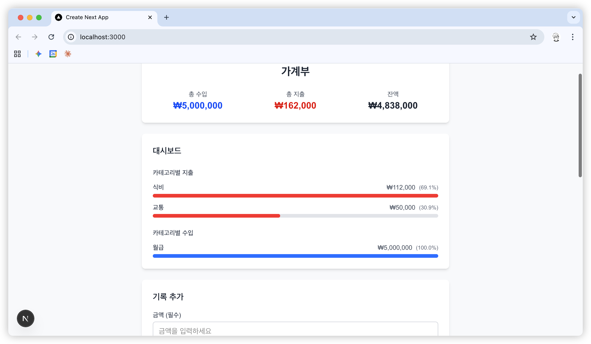
내 입맛에 맞게 기능이나 디자인을 **바이브코딩**으로 변경해보세요.


---

## 3.4 문제 발견! 데이터가 사라진다

브라우저에서 새로고침(F5)을 해보세요.

**어? 데이터가 사라졌다!** 😱

### 왜 사라질까요?

현재 가계부는 데이터를 **메모리**에만 저장합니다.

| 메모리 | 데이터베이스 |
|--------|------------|
| 임시 저장소 | 영구 저장소 |
| 새로고침하면 사라짐 | 영원히 저장됨 |
| 컴퓨터 끄면 사라짐 | 컴퓨터 꺼도 남아있음 |

### 해결책

**데이터베이스**에 저장하면 됩니다!

다음 챕터에서 **Supabase**라는 서비스를 연결해서
새로고침해도 데이터가 유지되게 만들어볼 거예요.

---

## 3.5 (선택) 코드 살펴보기

> 이 섹션은 건너뛰어도 됩니다!
> 궁금한 분들만 읽어보세요.

### 파일 구조

왼쪽 사이드바에서 `app/page.tsx` 파일을 열어보세요.

AI가 만든 코드가 보입니다.

### 주요 개념

#### 'use client'

```tsx
'use client';
```

맨 위에 있는 이 코드는 "이 파일은 브라우저에서 실행해줘"라는 의미입니다.
버튼 클릭, 입력 같은 사용자 상호작용이 있으면 필요합니다.

#### useState

```tsx
const [transactions, setTransactions] = useState([]);
```

`useState`는 **변하는 데이터**를 관리하는 방법입니다.
`transactions`에 거래 내역들이 저장되고,
`setTransactions`로 데이터를 변경할 수 있습니다.

#### map

```tsx
{transactions.map((t) => (
  <div key={t.id}>...</div>
))}
```

`map`은 **배열의 각 항목을 화면에 표시**할 때 사용합니다.
거래 내역 하나하나를 화면에 보여주는 역할입니다.

---

## 3.6 문제가 생겼다면?

### 화면이 안 나와요

1. 터미널 확인 - 에러 메시지가 있나요?
2. `npm run dev`가 실행 중인지 확인
3. 브라우저 주소가 `localhost:3000`인지 확인

### 빌드가 실패했어요

1. 에러 메시지를 복사
2. AI에게 질문:
   ```
   이 에러가 나는데 해결해줘:
   [에러 메시지]
   ```

### 기능이 제대로 안 돼요

AI에게 구체적으로 요청:
```
가계부에서 삭제 버튼이 안 돼.
클릭해도 아무 반응이 없어.
고쳐줘.
```

---

## 핵심 정리

```
✅ npx create-next-app@latest [프로젝트명] - 프로젝트 생성
✅ npm run dev - 개발 서버 실행
✅ localhost:3000 - 브라우저에서 확인
✅ Plan 모드 - AI가 계획 세우고 자동 실행
✅ 현재 문제: 새로고침하면 데이터 사라짐
✅ 해결책: 데이터베이스 연결 (다음 챕터!)
```

---

## 다음 챕터에서는

> 데이터베이스(Supabase)를 연결해서
> 새로고침해도 데이터가 유지되게 만들어봅니다!
>
> 👉 [Chapter 4. 데이터베이스 연결하기](part1/chapter4-database.md)

