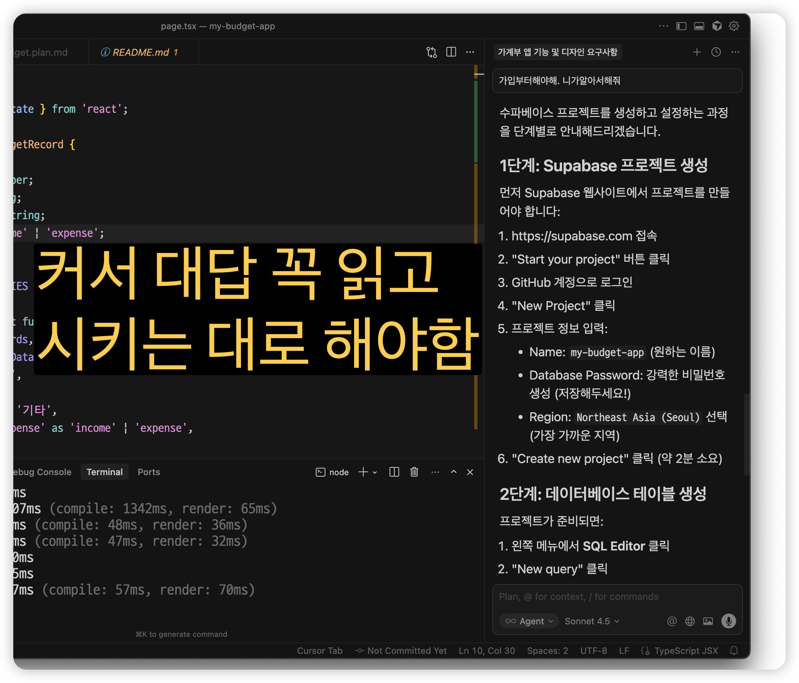
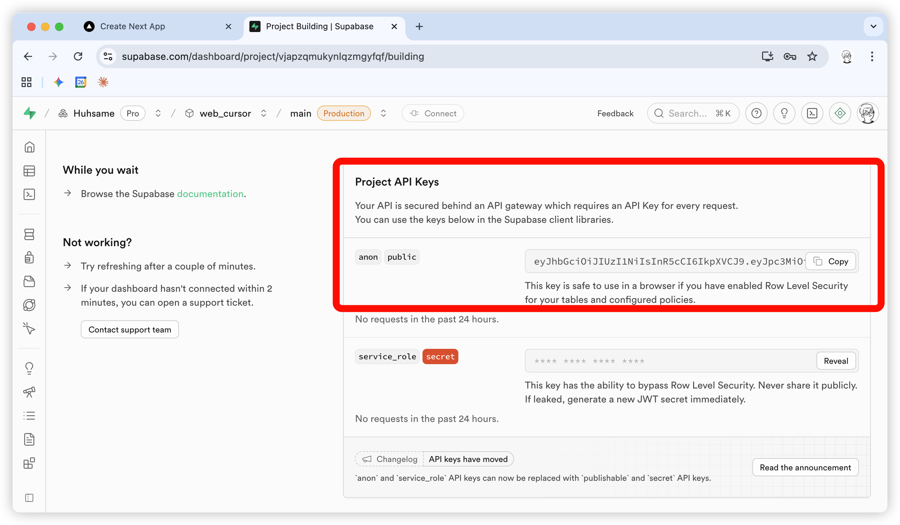
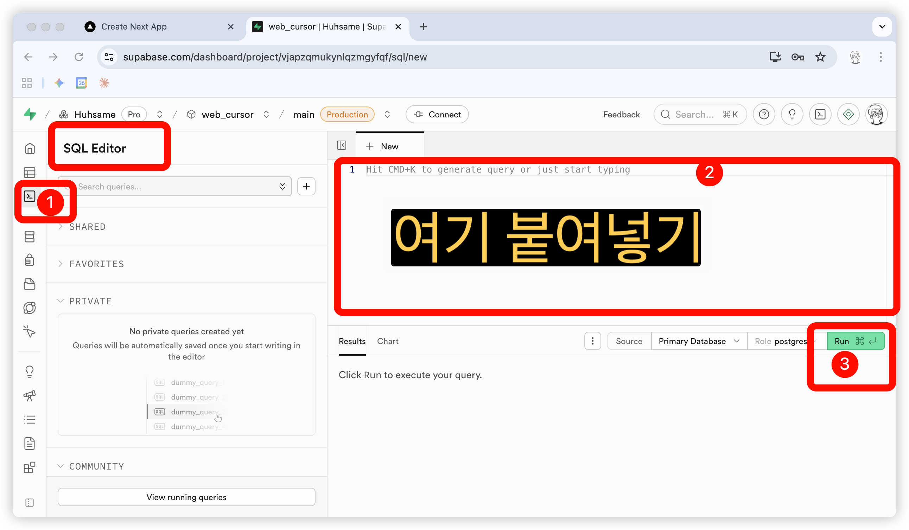
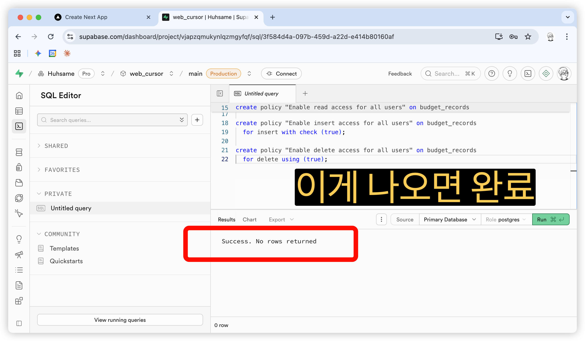
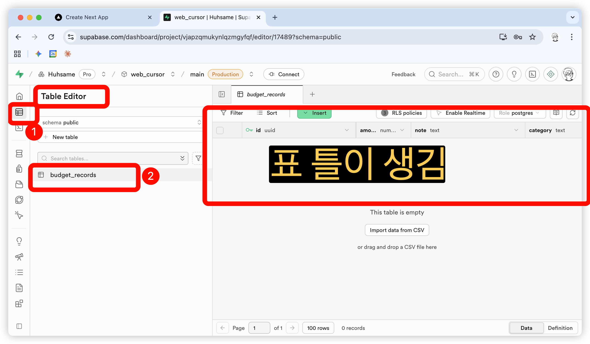
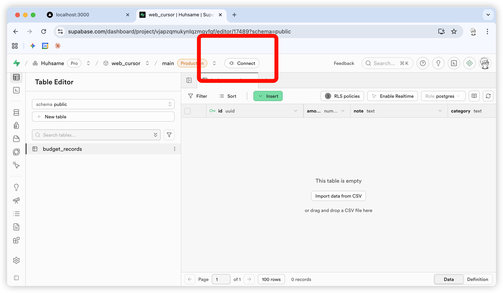
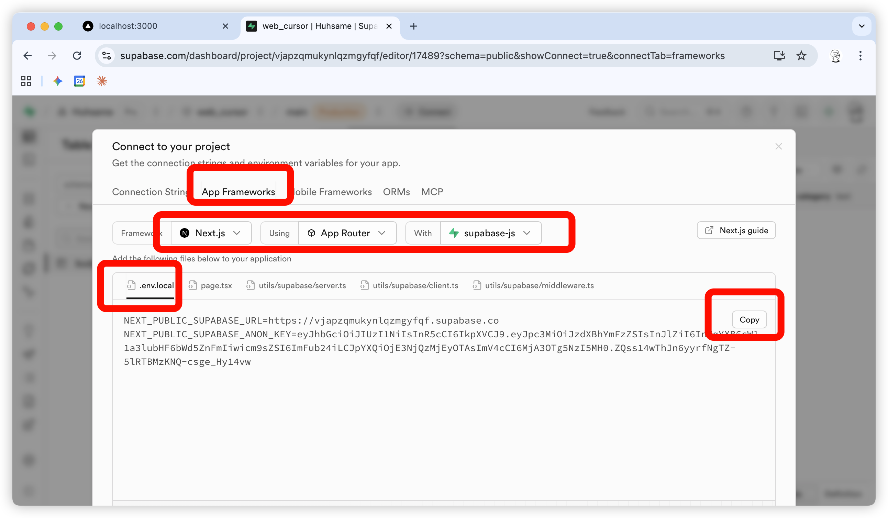
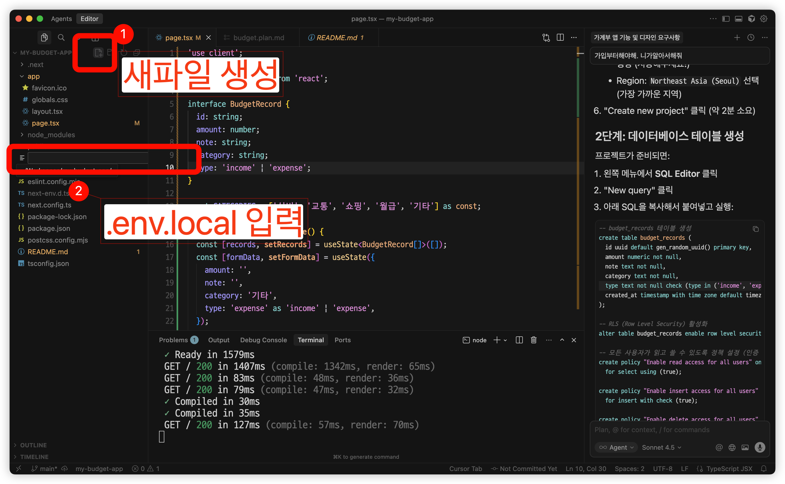
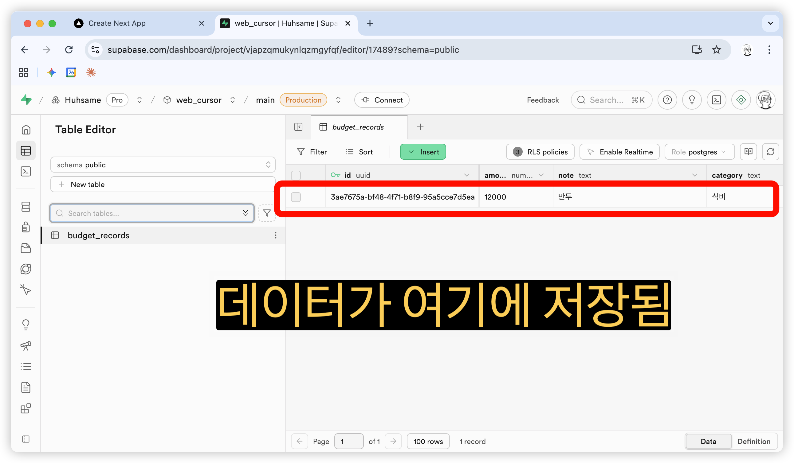

# Chapter 4. 데이터베이스 연결하기

이전 챕터에서 새로고침하면 데이터가 사라지는 문제가 있었죠?

이번 챕터에서 **Supabase**를 연결해서
데이터가 영구적으로 저장되게 만들어봅니다!

---

## 4.1 왜 데이터가 사라질까?

### 현재 상황

지금 가계부는 데이터를 **메모리**에 저장합니다.

```
메모리 = 컴퓨터의 임시 저장소
```

- 브라우저 새로고침 → 데이터 사라짐
- 브라우저 끄기 → 데이터 사라짐
- 컴퓨터 재시작 → 데이터 사라짐

### 해결책: 데이터베이스

```
데이터베이스 = 영구 저장소
```

- 새로고침해도 → 데이터 유지!
- 브라우저 꺼도 → 데이터 유지!
- 컴퓨터 꺼도 → 데이터 유지!
- 심지어 다른 컴퓨터에서도 → 같은 데이터!

---

## 4.2 Supabase 소개

### Supabase가 뭔가요?

> **무료로 쓸 수 있는 데이터베이스 서비스**입니다.
>
> 복잡한 설정 없이 클릭 몇 번으로
> 데이터베이스를 만들 수 있어요.

### 왜 Supabase를 쓰나요?

| 장점 | 설명 |
|------|------|
| **무료** | 작은 프로젝트는 무료로 충분 |
| **쉬움** | 클릭 몇 번으로 설정 완료 |
| **한국어** | 대시보드가 이해하기 쉬움 |
| **인기** | 많은 개발자들이 사용 |

### 무료 플랜 제한

> - 프로젝트 2개까지
> - 500MB 데이터베이스 저장공간
> - 1GB 파일 저장공간
>
> 💡 강의 실습에는 충분합니다!

---

## 4.3 데이터베이스 기본 개념

### 테이블이란?

> **엑셀 시트와 비슷합니다!**


| 엑셀 | 데이터베이스 |
|------|------------|
| 시트 | 테이블 |
| 행 (가로줄) | Row (행) |
| 열 (세로줄) | Column (열) |
| 셀 | 값 (Value) |

### 예시: 거래내역 테이블

```
transactions (거래내역) 테이블
┌────┬────────┬──────────┬──────────┬────────┬──────────────────────┐
│ id │ amount │ content  │ category │ type   │ created_at           │
├────┼────────┼──────────┼──────────┼────────┼──────────────────────┤
│ 1  │ 15000  │ 점심     │ 식비     │ 지출   │ 2024-01-15 12:30:00  │
│ 2  │ 3000000│ 월급     │ 월급     │ 수입   │ 2024-01-15 09:00:00  │
│ 3  │ 2500   │ 버스비   │ 교통     │ 지출   │ 2024-01-15 08:00:00  │
└────┴────────┴──────────┴──────────┴────────┴──────────────────────┘
```

**각 열(Column) 설명:**
- `id` - 고유 번호 (자동 생성)
- `amount` - 금액
- `content` - 내용
- `category` - 카테고리
- `type` - 수입/지출
- `created_at` - 생성 시간 (자동 생성)

---

## 4.4 SQL이란?

### SQL = 데이터베이스와 대화하는 언어

> 데이터베이스에 "데이터 가져와", "데이터 추가해" 같은
> 명령을 내리는 언어입니다.

### 핵심 명령어 4가지

| 명령어 | 역할 | 예시 |
|--------|------|------|
| **SELECT** | 데이터 조회 | "가져와" |
| **INSERT** | 데이터 추가 | "넣어" |
| **UPDATE** | 데이터 수정 | "바꿔" |
| **DELETE** | 데이터 삭제 | "지워" |

### SQL 예시

**모든 거래내역 가져오기:**
```sql
SELECT * FROM transactions
```
→ "transactions 테이블에서 전부(*) 가져와"

**지출만 가져오기:**
```sql
SELECT * FROM transactions WHERE type = '지출'
```
→ "transactions에서 type이 '지출'인 것만 가져와"

**새 거래 추가하기:**
```sql
INSERT INTO transactions (amount, content, category, type)
VALUES (15000, '점심', '식비', '지출')
```
→ "transactions에 새 데이터 넣어"

### 걱정하지 마세요!

> **SQL을 직접 쓸 일은 거의 없습니다!**
>
> 테이블 만들 때만 SQL을 복사-붙여넣기 하고,
> 나머지는 Supabase가 알아서 해줍니다.

---

## 4.5 Cursor에게 DB 연결 요청하기

### 간단하게 AI에게 물어보기

가계부 앱이 완성된 상태에서, **Cursor에게 간단하게 요청**해봅시다!

커서의 **Chat** 기능을 열고, **아래 내용을 복사해서 붙여넣기**:

```
사용자가 입력한 데이터를 Supabase에 연결해서 저장하고 싶어.
새로고침해도 데이터가 유지되게 해줘.
```


### AI의 응답 확인하기

AI가 친절하게 단계별로 알려줄 겁니다!

**예상 응답:**
```
Supabase를 사용해서 데이터를 저장하려면 다음 단계가 필요합니다:

1. Supabase 회원가입 및 프로젝트 생성
2. 데이터베이스 테이블 생성 (아래 SQL 사용)
3. API 키 복사
4. .env.local 파일에 키 설정
5. @supabase/supabase-js 패키지 설치
6. 코드 수정

[SQL 쿼리]
CREATE TABLE transactions (
  id BIGSERIAL PRIMARY KEY,
  created_at TIMESTAMPTZ DEFAULT NOW(),
  amount INTEGER NOT NULL,
  content TEXT,
  category TEXT DEFAULT '기타',
  type TEXT NOT NULL
);
...
```



> 💡 **AI가 필요한 모든 것을 알려줍니다!**
> 이제 AI가 알려준 순서대로 하나씩 따라해봅시다.

---

## 4.6 Supabase 회원가입하기

AI가 첫 번째로 "Supabase 회원가입"을 하라고 했죠?

### Step 1: 회원가입


1. 브라우저에서 **[supabase.com](https://supabase.com)** 접속
2. **Start your project** 또는 **Sign Up** 클릭
3. GitHub 계정으로 가입 (추천) 또는 구글 가입


### Step 2: 새 프로젝트 만들기

1. **New Project** 클릭
2. 정보 입력:
   - **Name**: `my-budget-app` (원하는 이름)
   - **Database Password**: 비밀번호 입력 (기억해두세요!)
   - **Region**: `Northeast Asia (Seoul)` 선택
3. **Create new project** 클릭


> ⏳ 프로젝트 생성에 1~2분 정도 걸립니다.

### Step 3: 대시보드 확인

프로젝트가 만들어지면 대시보드가 보입니다.


---

## 4.7 SQL로 테이블 만들기

AI가 두 번째로 "SQL로 테이블 만들기"를 하라고 했죠?

### Step 1: SQL Editor 열기

Supabase 대시보드 왼쪽 메뉴에서 **SQL Editor** 클릭



### Step 2: AI가 만든 SQL 붙여넣기

**Cursor가 알려준 SQL 쿼리를 복사해서 붙여넣기**하세요!


### Step 3: 실행하기


**Run** 버튼 클릭 (또는 `Ctrl + Enter`)

**Success** 메시지가 나오면 성공!

### Step 4: 테이블 확인

1. 왼쪽 메뉴에서 **Table Editor** 클릭
2. 테이블이 보이면 성공!



---

## 4.8 API 키 복사하기

AI가 세 번째로 "API 키 복사"를 하라고 했죠?




---

## 4.9 환경변수 파일 만들기

AI가 네 번째로 ".env.local 파일 만들기"를 하라고 했죠?

### Step 1: .env.local 파일 만들기


커서에서 프로젝트 루트(최상위 폴더)에 새 파일을 만듭니다.

**파일명:** `.env.local`

> 💡 파일명 앞에 점(.)이 있습니다!

### Step 2: 키 붙여넣기

**.env.local** 파일에 아까 복사한 것을 붙여넣으세요:


**예시:**
```
NEXT_PUBLIC_SUPABASE_URL=https://abcdefgh.supabase.co
NEXT_PUBLIC_SUPABASE_ANON_KEY=eyJhbGciOiJIUzI1NiIsInR5cCI6IkpXVCJ9...
```


> ⚠️ **.env.local 파일은 비밀 정보가 들어있으므로**
> **절대 다른 사람에게 공유하면 안 됩니다!**

---

## 4.10 Supabase 패키지 설치하기

AI가 다섯 번째로 "패키지 설치"를 하라고 했죠?

터미널에서 **아래 명령어를 실행**하세요:

```bash
npm install @supabase/supabase-js
```


---

## 4.11 테스트하기

### Step 1: 개발 서버 재시작

터미널에서:
1. `Ctrl + C`로 서버 종료 (맥도 Ctrl 사용)
2. `npm run dev`로 다시 시작

> 💡 **환경변수(.env.local)를 변경했을 때는 꼭 서버를 재시작해야 합니다!**

### Step 2: 데이터 추가하기

브라우저에서 `localhost:3000`에 접속해서 가계부를 추가해보세요.

### Step 3: Supabase에서 확인하기



1. Supabase 대시보드로 이동
2. **Table Editor** 클릭
3. 우리 데이터 테이블 클릭
4. 방금 추가한 데이터가 보이면 성공!


### Step 4: 새로고침 테스트 🎉

브라우저에서 **새로고침(F5)**을 해보세요.

**데이터가 그대로 있습니다!** 🎉🎉🎉

---

## 4.12 문제가 생겼다면?

### "데이터가 안 불러와져요"

1. `.env.local` 파일 확인
   - URL과 Key가 제대로 들어갔나요?
   - 따옴표 없이 값만 넣었나요?

2. 서버 재시작 했나요?
   - 환경변수 변경 후에는 꼭 재시작!

3. Supabase 테이블 확인
   - 테이블이 있나요?

### "에러가 나요"

에러 메시지를 복사해서 AI에게 질문:
```
이 에러가 나는데 해결해줘:
[에러 메시지]
```

---

## 핵심 정리

```
✅ 데이터베이스 = 데이터 영구 저장소
✅ 테이블 = 엑셀 시트와 비슷
✅ SQL = 데이터베이스와 대화하는 언어
✅ Supabase = 무료 데이터베이스 서비스
✅ .env.local = API 키 저장 파일 (비밀!)
✅ 이제 새로고침해도 데이터 유지!
```

---

## 다음 챕터에서는

> 가계부를 인터넷에 공개해서
> 누구나 접속할 수 있게 배포합니다!
>
> 👉 [Chapter 5. 세상에 공개하기](part1/chapter5-deploy.md)

