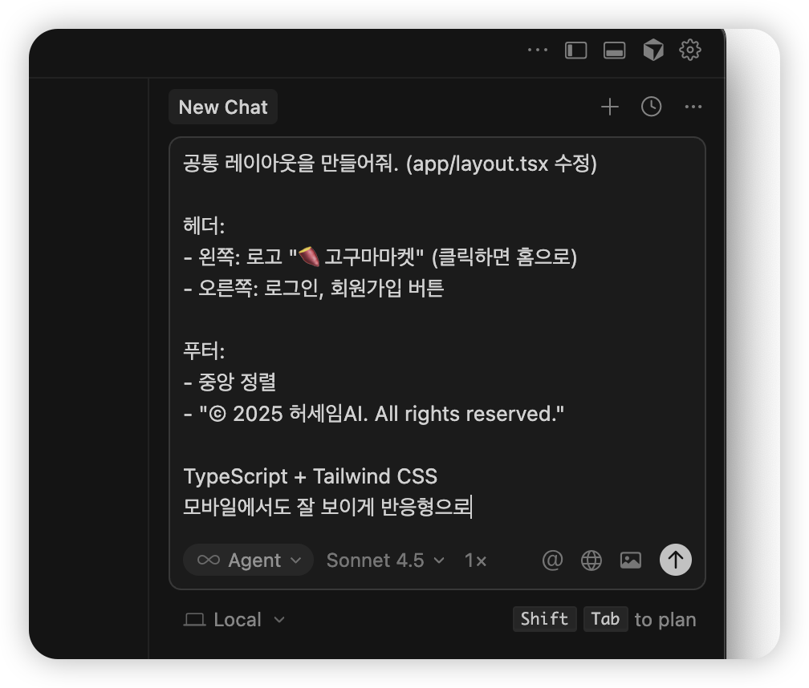
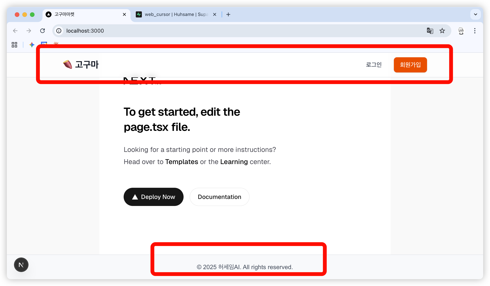
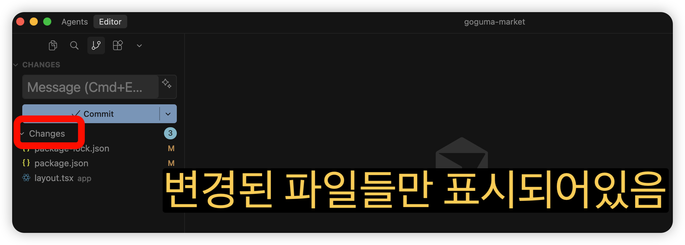
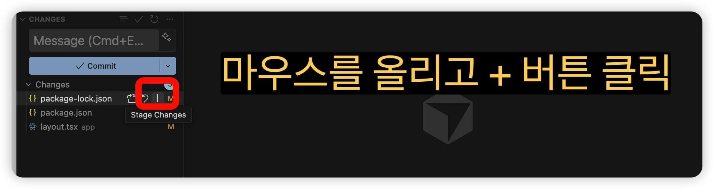
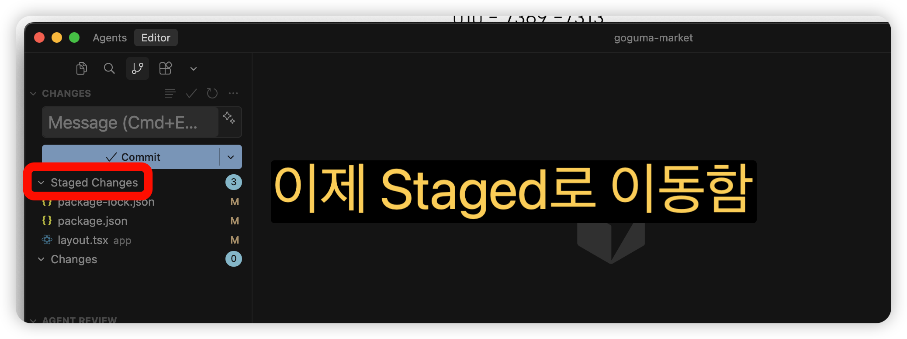
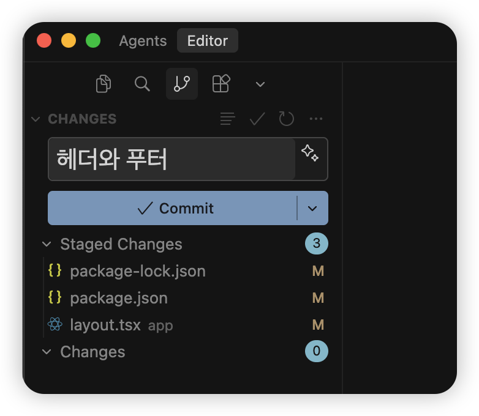
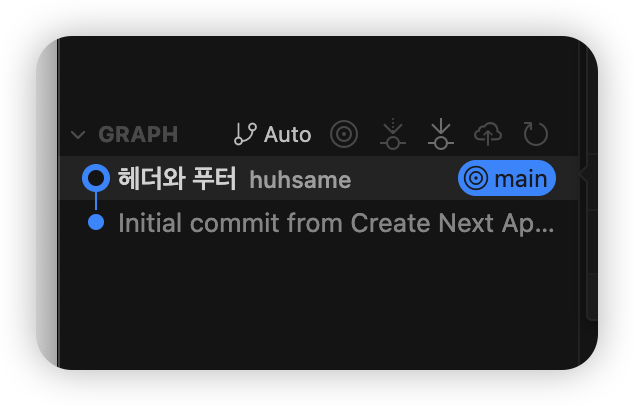
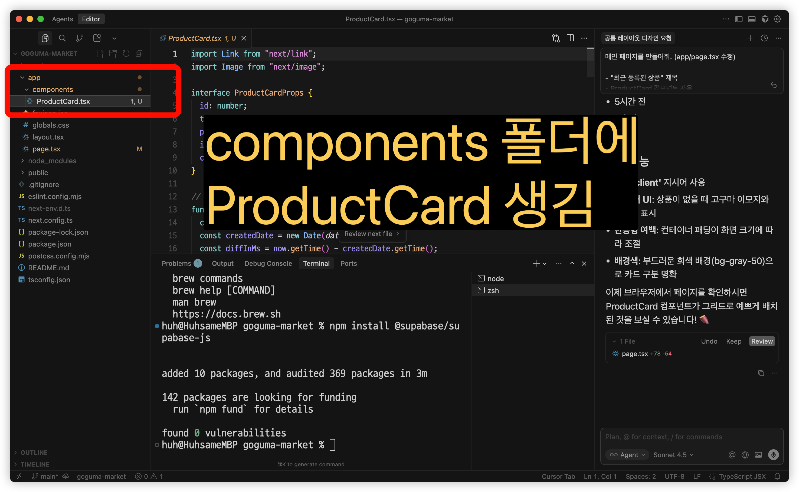
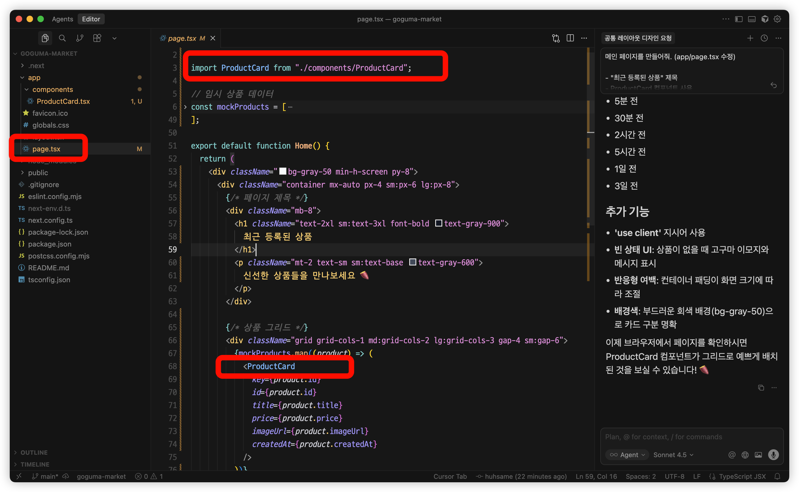
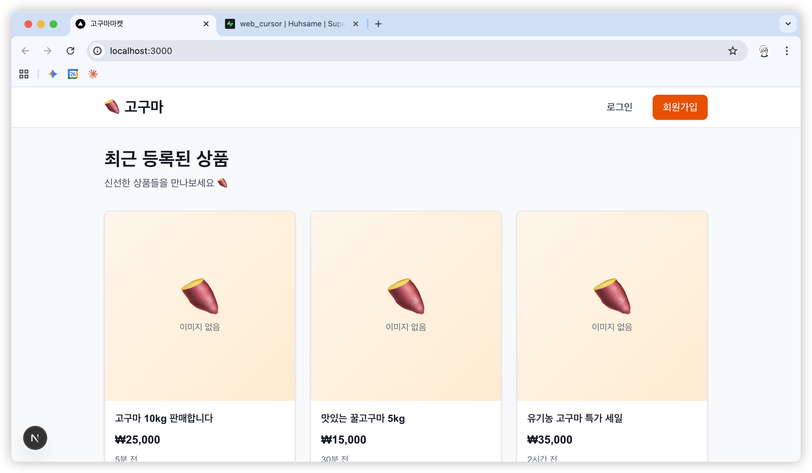

# Chapter 7. 메인 페이지 만들기

이번 챕터에서는 고구마마켓의 **공통 레이아웃**과 **메인 페이지**를 만듭니다.

---

## 7.1 공통 레이아웃 만들기

### 레이아웃이란?

> **모든 페이지에 공통으로 보이는 부분**입니다.
>
> - 헤더 (상단 메뉴)
> - 푸터 (하단 정보)

### AI에게 요청하기

커서 Chat에서 **복사-붙여넣기**:

```
공통 레이아웃을 만들어줘. (app/layout.tsx 수정)

헤더:
- 왼쪽: 로고 "🍠 고구마마켓" (클릭하면 홈으로)
- 오른쪽: 로그인, 회원가입 버튼

푸터:
- 중앙 정렬
- "© 2025 허세임AI. All rights reserved."

TypeScript + Tailwind CSS
모바일에서도 잘 보이게 반응형으로
```

### AI 응답 적용하기

1. 변경 내용 확인 
2. Keep 클릭


### 테스트하기


브라우저에서 `localhost:3000` 확인!
- 헤더가 보이나요?
- 푸터가 보이나요?

### 📝 커밋하기
가지치기 모양을 눌러 커밋메뉴로 이동하면 다음과 같이 Changes 라는 곳에 파일들이 나와있다.



변경이 있는 파일중에서, 수정사항을 컨펌할 파일들만 선택한다. 지금은 모두 선택


+버튼을 누르면 스테이지 되었다고 표현한다.


이제 커밋 메시지를 추가후 커밋 클릭


커밋 잘 되었나 확인


주의사항: 아직은 커밋만 한 상태. Github에 반영되지 않는다. 
---

## 7.2 컴포넌트란?

### 쉽게 말하면

> **재사용 가능한 UI 조각**입니다.
>
> 레고 블록처럼 조립해서 페이지를 만들어요.

### 예시

```
상품 카드 컴포넌트 하나 만들어두면:

┌─────────┐ ┌─────────┐ ┌─────────┐
│ 상품카드 │ │ 상품카드 │ │ 상품카드 │
│ 재사용!  │ │ 재사용!  │ │ 재사용!  │
└─────────┘ └─────────┘ └─────────┘

한 번 만들고, 여러 곳에서 사용!
```

### Props란?

> **컴포넌트에 데이터를 전달하는 방법**입니다.

```tsx
// 부모가 자식에게 데이터 전달
<ProductCard
  title="아이폰 13"
  price={500000}
/>
```

---

## 7.3 상품 카드 컴포넌트 만들기

### AI에게 요청하기

```
상품 카드 컴포넌트를 만들어줘.
(app/components/ProductCard.tsx)

표시할 정보:
- 상품 이미지 (없으면 기본 이미지)
- 상품 제목
- 가격 (₩ 표시, 콤마)
- 등록 시간 (몇 분 전, 몇 시간 전 형태)

Props:
- id: number
- title: string
- price: number
- imageUrl: string | null
- createdAt: string

카드 클릭하면 /products/[id] 로 이동
그림자, 호버 효과 있게
TypeScript + Tailwind
```

### 미리보기

아직 페이지를 개발한게 아니고 페이지에 필요한 부품(컴포넌트)만 만들어두었기 때문에 아직 미리보기에 나타나는 것은 없다. 



---

## 7.4 메인 페이지 만들기

### AI에게 요청하기

```
메인 페이지를 만들어줘. (app/page.tsx 수정)

- "최근 등록된 상품" 제목
- ProductCard 컴포넌트 사용
- 그리드 레이아웃 (모바일 1열, 태블릿 2열, PC 3열)
- 임시 상품 데이터 6개 만들어서 표시

'use client' 사용
TypeScript + Tailwind
```

page.tsx 코드를 보면, 아까 만든 ProductCard 컴포넌트를 활용하는 것을 확인할 수 있다. 


### 테스트하기



브라우저에서 확인!
- 상품 카드들이 보이나요?
- 화면 크기 줄이면 열 수가 바뀌나요?

### 📝 커밋하기

```
메인 페이지 상품 목록 UI
```

---

## 7.5 코드 이해하기 (선택)

> 이 섹션은 건너뛰어도 됩니다!

### 그리드 레이아웃

```tsx
<div className="grid grid-cols-1 md:grid-cols-2 lg:grid-cols-3 gap-4">
```

| 클래스 | 의미 |
|--------|------|
| `grid` | 그리드 레이아웃 |
| `grid-cols-1` | 기본 1열 |
| `md:grid-cols-2` | 768px 이상에서 2열 |
| `lg:grid-cols-3` | 1024px 이상에서 3열 |
| `gap-4` | 요소 간 간격 |

### 반응형 디자인

> **화면 크기에 따라 레이아웃이 바뀌는 것**입니다.

| 접두사 | 화면 크기 |
|--------|----------|
| (없음) | 기본 (모바일) |
| `sm:` | 640px 이상 |
| `md:` | 768px 이상 |
| `lg:` | 1024px 이상 |
| `xl:` | 1280px 이상 |


---

## 핵심 정리

```
✅ 레이아웃 = 모든 페이지 공통 UI (헤더, 푸터)
✅ 컴포넌트 = 재사용 가능한 UI 조각
✅ Props = 컴포넌트에 데이터 전달
✅ 반응형 = 화면 크기에 따라 레이아웃 변경
✅ 각 기능 완성 후 커밋!
```

---

## 다음 챕터에서는

> 데이터베이스 테이블을 설계하고 만들어봅니다!
>
> 👉 [Chapter 8. 데이터베이스 설계](part2/chapter8-db-design.md)

